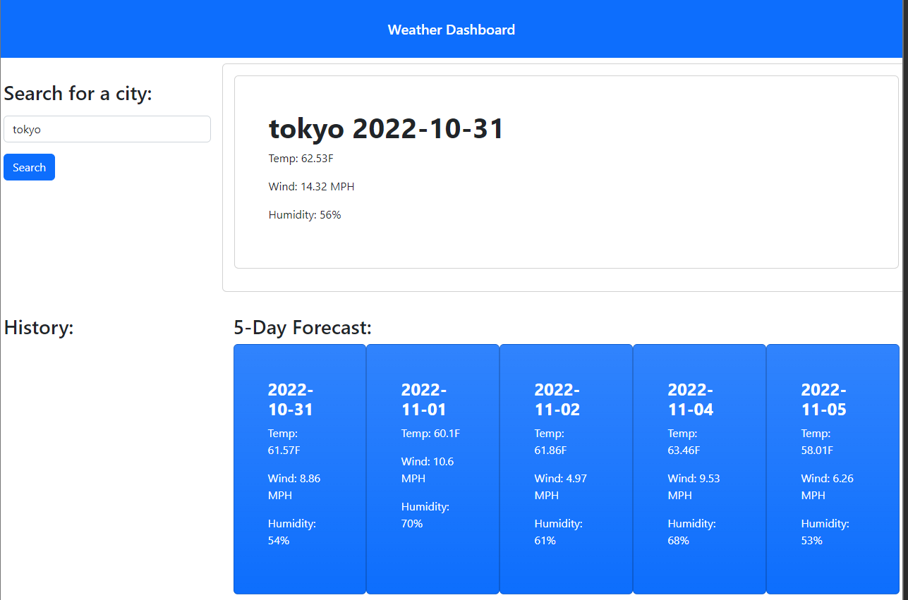

# WeatherDashboard
## Description

This Project challenged the developer to utilise third party APIs with the use of specific parameters to retreve the desired data. This data was then reformed into a relevant context. 

## User Story
```md
AS A traveler
I WANT to see the weather outlook for multiple cities
SO THAT I can plan a trip accordingly
```
## Acceptance Criteria
```md
GIVEN a weather dashboard with form inputs
WHEN I search for a city
THEN I am presented with current and future conditions for that city and that city is added to the search history
WHEN I view current weather conditions for that city
THEN I am presented with the city name, the date, an icon representation of weather conditions, the temperature, the humidity, and the the wind speed
WHEN I view future weather conditions for that city
THEN I am presented with a 5-day forecast that displays the date, an icon representation of weather conditions, the temperature, the wind speed, and the humidity
WHEN I click on a city in the search history
THEN I am again presented with current and future conditions for that city
Mock-Up
```

## Built With

* HTML
* CSS
    * Bootstrap (CSS Framework)
* JavaScript
* Server-Side APIs
    * [Open Weather Map API](https://openweathermap.org/forecast5)

## Usage 

To access this website, follow the link below and you will be redirected. Type your city of intrest into the search bar and hit the button below. The results for weather contditions in the area across the next 5 days will be displayed. Data for the current day will be displayed both on the larger display card and the first smaller card.

Below is the link to the webpage

https://jasminshea.github.io/PlanTravel/



## Credits

Made by
* [Jasmin Shearer](https://github.com/jasminshea)

